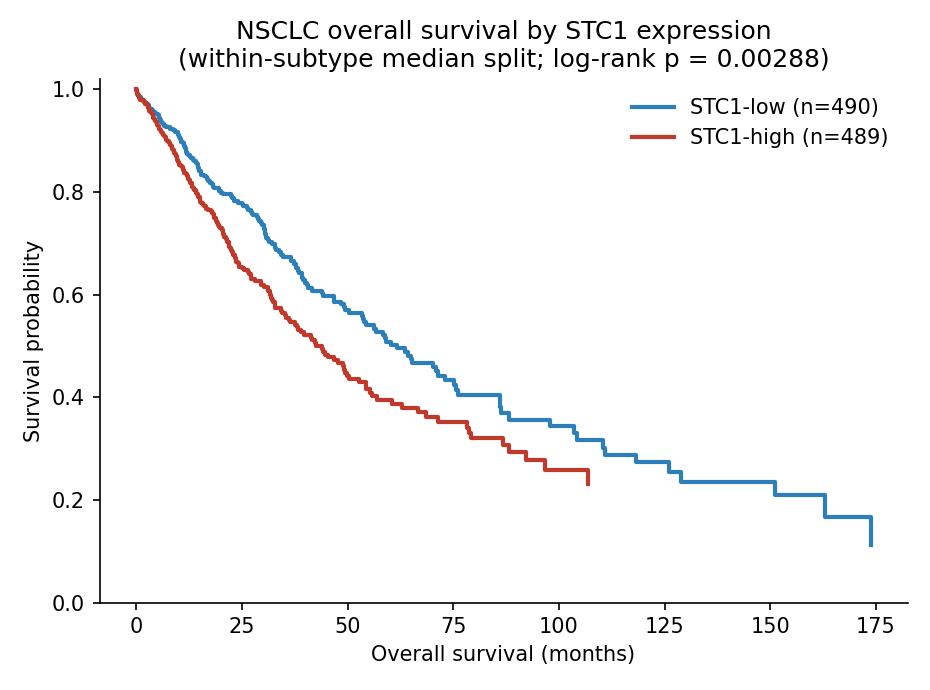

# Loss of chromosome 8p, and of *STC1*, distinguishes indolent from metastatic NSCLC: a negative-selection analysis of TCGA

*Working draft — TCGA LUAD + LUSC (PanCancer Atlas). All analyses reproducible from `scripts/` in this repository.*

## Abstract

Bulk primary tumours rarely carry a clean transcriptional signature of metastasis,
because "metastatic" tumours differ from non-metastatic ones mainly in
proliferation — a proxy for stage, not for metastatic capability. We reframed the
question as **negative selection**: rather than asking what metastatic tumours
*gain*, we asked what confirmed-indolent tumours *lose*. Using a stringent
"true stage I" reference (stage I, N0/M0, recurrence-free ≥ 2 years) against
tumours that progressed, we find that a chromosome **8p** deletion is present in
~9% of indolent tumours but almost absent (0.8%) in metastatic ones
(subtype-adjusted CMH q ≈ 0.027). Because 8p is lost as a whole arm, we used
expression — controlling for both gene dosage and proliferation — to resolve the
locus to **STC1** (stanniocalcin-1, 8p21.2), a secreted hypoxia-induced promoter of
EMT and angiogenesis. High STC1 predicts significantly worse overall survival
(median 44.0 vs 61.6 months; log-rank p = 0.003), an association independent of
proliferation. We propose that retention of 8p/STC1 marks metastatic capability in
NSCLC — an association-level hypothesis for validation in metastasis-enriched cohorts.

## Background and hypothesis

Identifying genes that specifically mark metastasis (as opposed to general tumour
aggression) is confounded in bulk primary tissue: metastatic primaries are simply
more proliferative, and proliferation dominates every differential test.

We therefore inverted the logic. A tumour that presents at **stage I and remains
recurrence-free for years** has demonstrably never acquired the ability to spread.
If metastasis requires some cellular machinery, such indolent tumours may have
**lost** it — for example by deep-deleting a gene they never needed.

> **Hypothesis.** Genes required for (or permissive of) metastasis are **deletable
> in indolent tumours but retained in tumours that metastasize**. Equivalently:
> copy-number loss of metastasis machinery is a marker of indolent disease.

## Methods

**Cohort and data.** TCGA lung adenocarcinoma (LUAD) and squamous-cell carcinoma
(LUSC), PanCancer Atlas. mRNA expression (RSEM), discrete GISTIC copy number, and
clinical data were obtained from cBioPortal (`mirna_tcga.cbioportal`). Distant-
metastasis annotation was enriched with the TCGA **BCR Biotab** clinical
supplements (`mirna_tcga.biotab`), unioning pathologic M1 with clinical M1 and
follow-up `new_tumor_event_type = 'Distant Metastasis'`; this raised the confirmed
distant-metastatic NSCLC set from ~33 to 126.

**Groups.** A **"true stage I"** indolent reference (n = 218) was defined as stage I
at diagnosis, N0/M0, ≥ 2-year follow-up with no distant or locoregional recurrence
(`biotab.true_stage_i_vs_distant`). Progression-capable groups were distant
metastasis (n = 124) and node-positive disease (N+, n = 343).

**Negative-selection (deletion) screen.** For each gene, deep-deletion frequency was
compared between progressed and true-stage-I tumours with a **Cochran–Mantel–Haenszel
test stratified by subtype** (`associate.cmh_depletion_screen`); genes depleted for
deletion in progressed tumours are, equivalently, deleted more in indolent tumours.
BH-FDR across the deletable-gene set (script `23_true_stage_i_lost_genes.py`).

**Resolving the locus to a gene.** Because 8p deletes as one arm, deletion cannot
distinguish co-deleted genes. We tested each co-deleted gene's **expression**
(progressed vs indolent, subtype-stratified van Elteren rank-sum,
`associate.ranksum_screen`) against two confounders: (i) **dosage** — the same test
restricted to tumours where the gene is *not* deleted; (ii) **proliferation** —
strata of subtype × proliferation-tertile (`panels.PROLIFERATION_PANEL`)
(script `24_chr8p23_which_gene.py`).

**Survival.** Overall survival in NSCLC (~980 patients, 384 deaths). Association was
tested with a vectorized **Cox score test** (`screen.cox_score_screen`),
subtype-stratified and then subtype × proliferation-tertile stratified, with MKI67
as a proliferation positive control (script `25_stc1_survival_check.py`).
Kaplan–Meier curves and the two-group log-rank test (implemented directly) used a
**within-subtype median split** of STC1 expression (script `26_stc1_km_curve.py`).

## Results

### 1. No positive metastasis signature in the bulk primary

Genome-wide differential expression and copy-number screens (scripts 17–22) found
**no proliferation-independent signature of metastasis**. The entire nodal-metastasis
expression signal was proliferation (≈ 90% of hits vanished after proliferation
adjustment), and canonical EMT/invasion effectors (VIM, SNAI1/2, ZEB1/2, TWIST1,
FN1, MMPs, LOXL2, …) were not differentially expressed between node-positive and
node-negative primaries (0/28 significant). Distant metastasis showed no signature
in any layer.

### 2. Chromosome 8p is lost in indolent tumours and retained in metastatic ones

Against the true-stage-I reference, a co-deleted **chromosome 8p block** was the top
— and only FDR-significant — signal:

| Contrast | 8p deleted in true stage I | in progressed | CMH OR | q |
|---|---|---|---|---|
| distant-met vs true-stage-I (124 vs 208) | **9.1 %** | 0.8 % (1/124) | 0.07 | **0.027** |
| N+ vs true-stage-I (343 vs 208) | 9.1 % | 3.5 % | 0.36 | 0.085 |

The signal was concordant across subtypes (LUAD distant-met q ≈ 0.09; LUSC nodal
q ≈ 0.20) and reached significance on pooling. Indolent tumours delete 8p roughly
one time in eleven; tumours that metastasized almost never do.

### 3. Expression resolves the arm to *STC1*

8p is lost as a whole arm (~190 co-deleted genes with identical q), so we used
expression to identify the functional member. Most 8p genes are *lower* in
progressed tumours (8p is tumour-suppressor-rich), but the retention-tracks-
metastasis candidates are 8p genes **higher** in progressed that survive both
confounders:

| gene | up in progressed | dosage-independent | proliferation-adjusted | verdict |
|---|---|---|---|---|
| **STC1** | z=+3.31 (p=0.001) | z=+2.12 (p=0.034) | z=+2.27 (p=0.023) | **survives both** |
| LOXL2 | +2.46 (0.014) | +1.41 (0.16) | +2.20 (0.028) | prolif-independent, dosage-driven |
| CDCA2, PBK, ESCO2 | significant | — | ≈ 0 (NS) | proliferation passengers |

STC1 responds to its own copy number (deletion lowers its expression) and is up in
progressed tumours beyond both dosage and proliferation. STC1 (stanniocalcin-1) is a
secreted, hypoxia-induced factor promoting EMT, invasion and angiogenesis; LOXL2 is
an ECM-crosslinking EMT driver — both biologically coherent with metastasis.

### 4. High *STC1* predicts worse overall survival, independent of proliferation



Patients with high STC1 (within-subtype median split) had significantly shorter
overall survival: **median 44.0 vs 61.6 months, log-rank p = 0.003**. The
association held in a subtype-stratified Cox score test (z = 2.56, p = 0.011) and
**survived proliferation adjustment** (z = 2.27, p = 0.023). Critically, the
proliferation marker MKI67 showed the opposite behaviour — a nominal OS association
(p = 0.069) that **vanished** under the same proliferation adjustment (p = 0.55) —
confirming that STC1's prognostic value is not merely "proliferative tumours die
faster."

STC1 thus rests on three concordant lines of evidence: (1) it lies on 8p, deleted
in indolent but retained in metastatic tumours; (2) its expression is elevated in
progressed tumours beyond dosage and proliferation; and (3) it is prognostic for
worse survival, again beyond proliferation.

## Discussion

Reframing metastasis as negative selection — asking what indolent tumours lose
rather than what metastatic tumours gain — recovered a signal where conventional
differential analysis found only proliferation. The result nominates **8p
retention, and specifically STC1**, as a marker of metastatic capability in NSCLC,
consistent with STC1's known pro-metastatic biology.

**Limitations.** (1) This is an **association, not causation**: STC1 is
hypoxia-induced, so its elevation in aggressive tumours may partly reflect a hypoxic
microenvironment rather than a cell-intrinsic driver. (2) The candidate genes sit on
8p21 while the deletion peak is 8p23.1; whole-arm loss removes both, so expression —
not deletion — does the pointing. (3) TCGA samples are resected **primaries**; a
definitive test requires **matched primary–metastasis tissue** (e.g. MET500,
MSK-MET), where the prediction is direct: STC1 expression, and 8p retention, should
predict which primaries metastasize. (4) The distant-met deletion contrast rests on
a sparse cell (1/124 deleted), mitigated by the solid indolent-group rate (~19/208).

## Conclusion

In TCGA NSCLC, deep deletion of chromosome 8p marks indolent (true stage I) disease
and is almost absent in tumours that metastasize. Expression narrows this arm-level
signal to **STC1**, whose high expression independently predicts worse survival. We
propose *8p/STC1 retention* as a testable marker of metastatic capability in NSCLC.

---

### Reproducibility

```bash
python scripts/23_true_stage_i_lost_genes.py --save-dir results   # 8p lost in true stage I
python scripts/24_chr8p23_which_gene.py --save-dir results        # resolve arm -> STC1
python scripts/25_stc1_survival_check.py --save-dir results       # STC1 vs OS (proliferation-adjusted)
python scripts/26_stc1_km_curve.py --gene STC1 --save-dir docs/figures  # KM figure
```

Full methods and intermediate results: [`nsclc_metastasis_spared_deletions.md`](nsclc_metastasis_spared_deletions.md),
[`nsclc_metastasis_expression.md`](nsclc_metastasis_expression.md).
